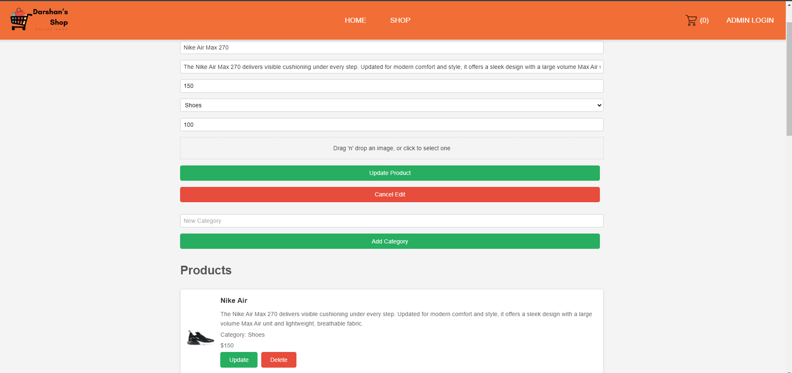
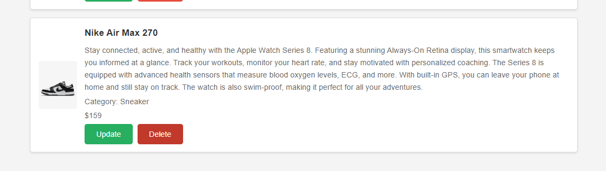
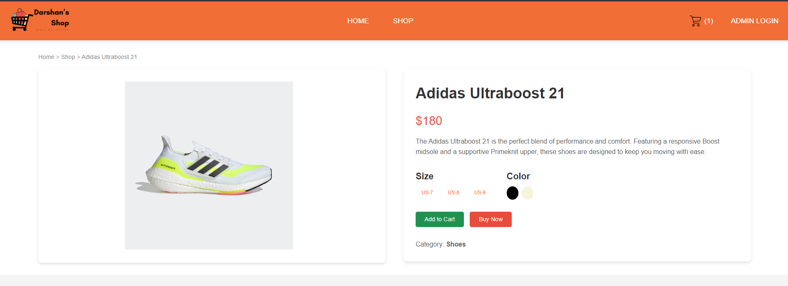
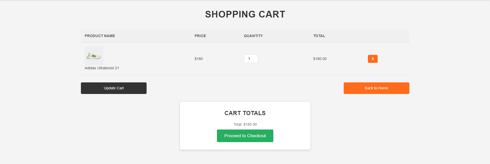
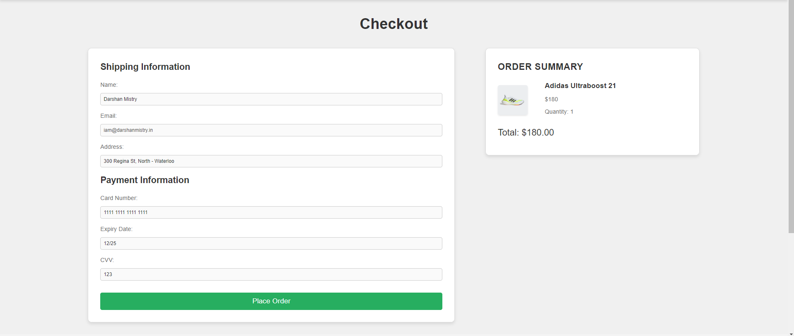
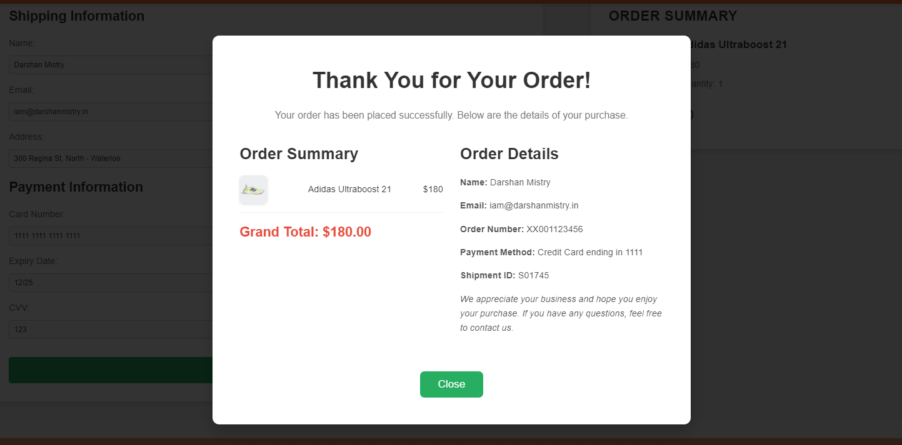
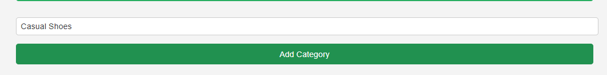

# **E-Commerce Project**

**Student Name:** Darshankumar Hiteshbhai Mistry

**Student Number:** 8967753

**Date:** 7 July 2024

------------------------------------------------------------------------------------

# Technology Stack

**Frontend:** ReactJS  
**Backend:** Node.js with Express  
**Database:** MongoDB 

-------------------------------------------------------------------------------------

# Database Schema Design

## Products Schema (MongoDB)
- `name: String`
- `description: String`
- `price: Number`
- `category: String`
- `stock: Number`
- `imageUrl: String`

### Categories Schema (MongoDB)
- `category_name`: String

-------------------------------------------------------------------------------------

Github Repo Link :- https://github.com/mistrydarshan222/E-Commerce

-------------------------------------------------------------------------------------

## Getting Started
Follow these instructions to get a copy of the project up and running on your local machine for development and testing purposes.

### Prerequisites
Ensure you have the following installed on your machine:
- Node.js
- npm (Node package manager)
- MongoDB

### Installation

1. **Clone the repository:**
git clone https://github.com/mistrydarshan222/E-Commerce
cd foldername

2. **Install dependencies for the backend:**
cd ecombackend
npm install

3. **Install dependencies for the frontend:**
cd ../ecomfrontend
npm install

### Running the Project

1. **Start MongoDB:**

Ensure your MongoDB server is running. 

2. **Set up environment variables:**

Create a `.env` file in the `ecombackend` and `ecomfrontend` directories with the following content:

**ecombackend/.env:**
MONGO_URI=mongodb://localhost:27017/yourdbname
PORT=5000

**ecomfrontend/.env:**
REACT_APP_BACKEND_URL=http://localhost:5000

3. **Start the backend server:**

Open a terminal and navigate to the `ecombackend` directory, then run:
npm start

The backend server will start and be accessible at `http://localhost:5000`.

4. **Start the frontend development server:**

Open another terminal and navigate to the `ecomfrontend` directory, then run:
npm start

The frontend development server will start and be accessible at `http://localhost:3000`.

### Environment Variables
The project requires the following environment variables to be set:

**ecombackend/.env:**

- `MONGO_URI`: The connection string for your MongoDB database.
- `PORT`: The port number on which the backend server will run.

**ecomfrontend/.env:**

- `REACT_APP_BACKEND_URL`: The base URL for the backend API.

### Features

- **Product Listings:** Display products with details such as name, description, price, and category.
- **Shopping Cart:** Allow users to add products to a cart and manage the cart.
- **Checkout Process:** Users can enter shipping and payment information (HardCoded Values), view their order summary, and place orders.
- **Order Confirmation:** A thank you popup is displayed after a successful order, showing order details.

**Admin Panel:**
- **Admin Login-** Admin can log in with given hardcoded credentials to manage the products and categories.
    **username** - Darshan
    **password** - 8967753
- **Product Management:** Admin can add, update, and delete products.
- **Category Management:** Admin can add, update, and delete categories.
- **Image Management:** Product images can be uploaded and managed efficiently, ensuring images don't need to be re-uploaded during product updates.

**New Features Added**
- **Improved Product Details:** Product pages include detailed descriptions, pricing, size and color options (HardCoded Values), and a well-structured layout.
- **Enhanced Cart and Checkout:** Cart page displays product images, and checkout includes a summary with product details and an order total.
- **Footer:** A consistent footer is added across all pages, featuring social media links and additional navigation.
- **Custom Fonts:** The entire website now uses the Poppins font for a modern and clean look.

**Testing**
Each test case describes the steps, expected results, and actual results.

- **Test Case 1: Show Products**
Steps:
   1- Navigate to the home page.
   2- View the list of products displayed on Featured Product section.
   
   Expected Result: Products are displayed with their name, price, and image.

   Actual Result: Pass
    

- **Test Case 2: Show Admin Dashboard**
Steps:
    1- Log in as an admin using the credentials.
    2- Navigate to the admin dashboard.

    Expected Result: The admin dashboard is displayed, showing the list of products and categories.

    Actual Result: Pass
    

- **Test Case 3: Create a New Product**
Steps:
    1- Log in as an admin.
    2- Add a new product with valid details.

    Expected Result: The product is successfully added and appears in the product list.
    
    Actual Result: Pass
    

- **Test Case 4: Edit an Existing Product**
Steps:
    1- Log in as an admin.
    2- Edit an existing product's details.

    Expected Result: The product details are updated without needing to re-upload the image.

    Actual Result: Pass
    

- **Test Case 5: Delete a Product**
Steps:
    1- Log in as an admin.
    2- Delete a Product

    Expected Result: The product is successfully removed from the list.

    Actual Result: Pass
    

- **Test Case 6: Add Product to Cart**
Steps:
    1- Navigate to a product's detail page.
    2- Click on "Add to Cart."

    Expected Result: The product is added to the cart and redirect to the cart page.

    Actual Result: Pass
    

- **Test Case 7: View Cart Page**
Steps:
    1- Navigate to the cart page.

    Expected Result: The cart displays the correct products, quantities, and total price.

    Actual Result: Pass
    

- **Test Case 8: Proceed to Checkout**
Steps:
    1- On the cart page, click "Proceed to Checkout."

    Expected Result: The checkout page displays the order summary and allows the user to enter shipping and payment information.

    Actual Result: Pass
    

- **Test Case 9: Place an Order**
Steps:
    1- On the checkout page, fill in the information and place the order.

    Expected Result: A thank you popup appears, and the order is confirmed.

    Actual Result: Pass
    

- **Test Case 10: Add a new category**
Steps:
    1- Log in to the admin dashboard
    2- Enter a new category name in the input field.
    3- Click on the "Add Category" button.

    Expected Result: The new category is added successfully and appears in the category list.

    Actual Result: Pass
    

